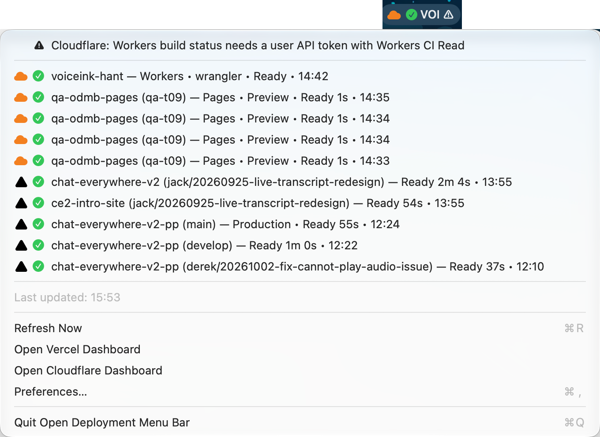

# Open Deployment Menu Bar

A macOS menu bar app that shows your **Vercel** and **Cloudflare Pages/Workers** deployments. The latest deployment's status sits in the menu bar, and clicking a row opens it in the browser.



This project is a fork of [andrewk17/vercel-deployment-menu-bar](https://github.com/andrewk17/vercel-deployment-menu-bar), extended with Cloudflare support.

## Features

- Vercel deployments, plus Cloudflare Pages deployments and Workers deployments. Each row shows the state: queued, building, ready, error, canceled or skipped.
- Workers rows can include Workers Builds status (building, failed, canceled) when the token allows it. Gradual rollouts show the traffic percentage.
- The menu bar shows the newest deployment across both platforms: ▲ for Vercel or ☁ for Cloudflare, followed by a state icon. In the menu, Vercel rows use a black ▲ and Cloudflare rows an orange ☁. A ⚠ appears when one platform has a problem while the other keeps working.
- Per-platform filters: scopes/accounts and projects (checkbox pickers), git branches, Production/Preview, deployment states, and a count or time limit.
- Two menu layouts: all deployments sorted by time, or grouped by platform.
- API tokens are stored in the macOS Keychain.
- Native Swift app.

## Installation

### Pre-built release

1. Download the latest release from the [Releases](https://github.com/1orZero/deployment-menu-bar/releases) page.
2. Unzip it and move `Open Deployment Menu Bar.app` to your Applications folder.
3. Launch the app, click its menu bar item and choose **Preferences…** to add your tokens.

### Build from source

Requirements:
- macOS 13.0 or later
- Swift 5.9 or later (Xcode 15 or later)
- Xcode 26 or later only if you want to regenerate the app icon's `Assets.car`

```bash
git clone https://github.com/1orZero/deployment-menu-bar.git
cd deployment-menu-bar

swift build -c release
./Scripts/package-app.sh

# Output: build/Open Deployment Menu Bar.app
```

### Packaging, signing and notarization

`Scripts/package-app.sh` builds the `.app` bundle and signs it with the identity in `SIGNING_IDENTITY`:

```bash
SIGNING_IDENTITY="Developer ID Application: Your Name (TEAMID)" ./Scripts/package-app.sh
```

When `SIGNING_IDENTITY` is unset, the app is signed ad-hoc and notarization is skipped. An ad-hoc build runs fine on your own Mac, but macOS asks for Keychain access again after each rebuild because the code signature changes.

Notarization also needs an App Store Connect API key:

```bash
export APPLE_API_KEY_ID="your-key-id"
export APPLE_API_ISSUER="your-issuer-id"
export APPLE_API_KEY_PATH="$HOME/.private_keys/AuthKey_XXXXXXXXXX.p8"
```

If these are missing, the script signs the app and skips notarization.

The app icon comes from `Resources/AppIcon-source.png` and `Resources/AppIcon.icon`. `Scripts/create-app-icon.sh` regenerates `Resources/AppIcon.icns` and, with Xcode 26 or later (`xcrun actool`), `Resources/Assets.car`. The bundle includes both: `Assets.car` gives the system-masked icon on macOS 26+, and the `.icns` is the fallback for older systems.

## Configuration

Open **Preferences…** from the menu. The window has three tabs: General, Vercel and Cloudflare. Changes save automatically. A platform without a token is turned off; with no token on either platform the menu bar shows "No Token".

### Vercel

1. Create a token at [Vercel Account Settings → Tokens](https://vercel.com/account/tokens). Copy it right away, because Vercel shows it only once.
2. Paste it into **Vercel API Token** on the Vercel tab.
3. Under **Scope & Project**, keep "All Accessible Scopes" or choose specific team scopes, then keep "All Projects In Scope" or choose specific projects. Both lists are checkbox pickers filled from your token.
4. Optional filters: git branches (comma-separated), Production/Preview, deployment states, and a limit by count or by the last X hours. If both limits are set, the count wins.

### Cloudflare

1. In the Cloudflare dashboard, go to **My Profile → API Tokens** and create a custom token with these read permissions:
   - Account Settings Read
   - Cloudflare Pages Read
   - Workers Scripts Read
2. To see Workers Builds status, the token must be a **user** API token that also has **Workers CI Read**. The Builds API rejects account-owned tokens. Without it, Workers deployments still appear without build status, and the menu bar shows ⚠ with the message "Workers build status needs a user API token with Workers CI Read".
3. Account-owned tokens work for Pages and Workers deployments.
4. Paste the token into **Cloudflare API Token** on the Cloudflare tab.
5. Optional: pick accounts and projects (Pages and Workers appear in one list), then set branch, environment, state (including Skipped) and limit filters.

### General

**Menu Layout** controls how the menu lists deployments:
- **By Time**: both platforms merged, newest first. Problems appear as banners at the top, and the Open Vercel/Cloudflare Dashboard items sit at the bottom.
- **By Platform**: a Vercel section and a Cloudflare section, each with its own banner, deployments and dashboard link.

### Refresh intervals and rate limits

- **Vercel**: every 15 seconds when idle, every 2 seconds while a deployment is building. Both are configurable.
- **Cloudflare**: a full refresh every 30 seconds (minimum 10). While something is queued or building, the app also re-checks only those rows every 5 seconds (minimum 2), one request per row.

Cloudflare allows 1200 API requests per 5 minutes per user. A full refresh costs a few requests per account and one per Worker or Pages project, so many projects with a short interval can hit the limit. Selecting specific accounts and projects cuts the request count. When Cloudflare returns 429, the app pauses all Cloudflare requests until `Retry-After` expires (60 seconds if missing), keeps the last rows, and shows ⚠ with a countdown.

### Tokens and the Keychain

Tokens are saved in the login Keychain under the service `com.1orzero.open-deployment-menu-bar`. Settings and a plain-text Vercel token from earlier versions (including the original Vercel Deployment Menu Bar) are migrated on first launch: the token moves to the Keychain and is removed from the settings.

## FAQ

### Which platforms are supported?

Vercel, Cloudflare Pages and Cloudflare Workers (including Workers Builds status with a suitable user token).

### Why do my Workers rows have no build status?

The Workers Builds API needs a user API token with Workers CI Read. Account-owned tokens and tokens without that permission still list Workers deployments, but without build status, and the menu bar shows ⚠.

### What does ⚠ in the menu bar mean?

One platform failed (bad token, missing permission, network error, or a Cloudflare rate limit) while the app still has data to show. Open the menu to read the banner. If every enabled platform fails and there is nothing to show, the menu bar shows "Error".

### How do I fix the "damaged app" error on macOS?

Builds signed ad-hoc are not notarized. Right-click the app and choose **Open**, or remove the quarantine attribute:

```bash
xattr -d com.apple.quarantine "/Applications/Open Deployment Menu Bar.app"
```

## License

MIT License. See [LICENSE](LICENSE).

## Disclaimer

Not affiliated with Vercel Inc. or Cloudflare, Inc. Vercel and Cloudflare are trademarks of their respective owners.

## Contributing

Pull requests are welcome.
